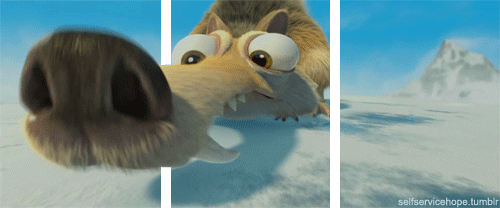
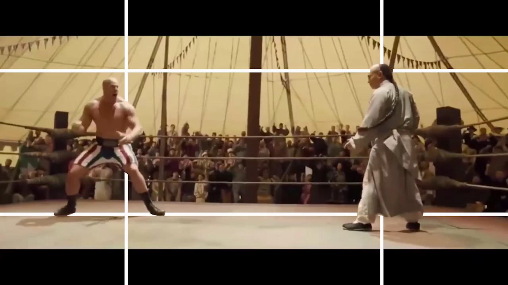
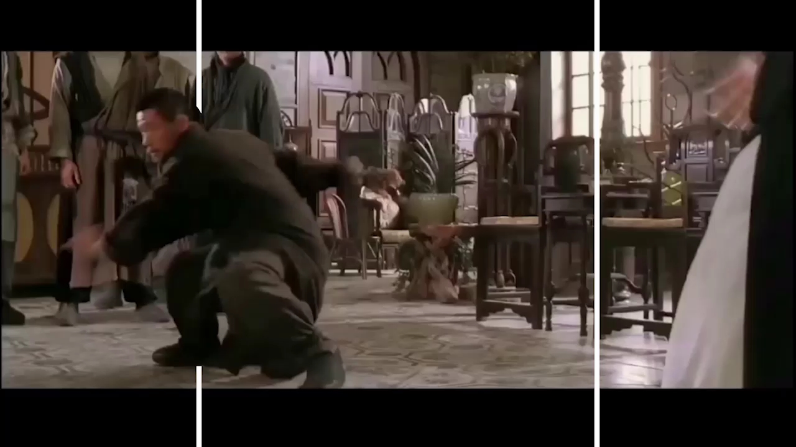
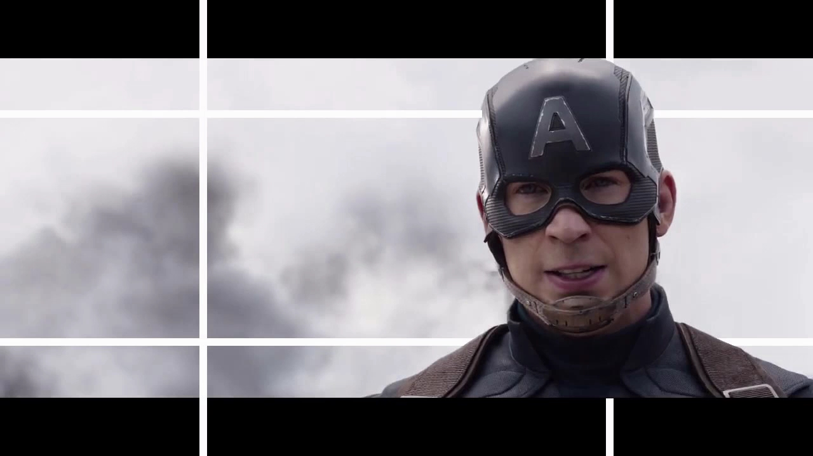
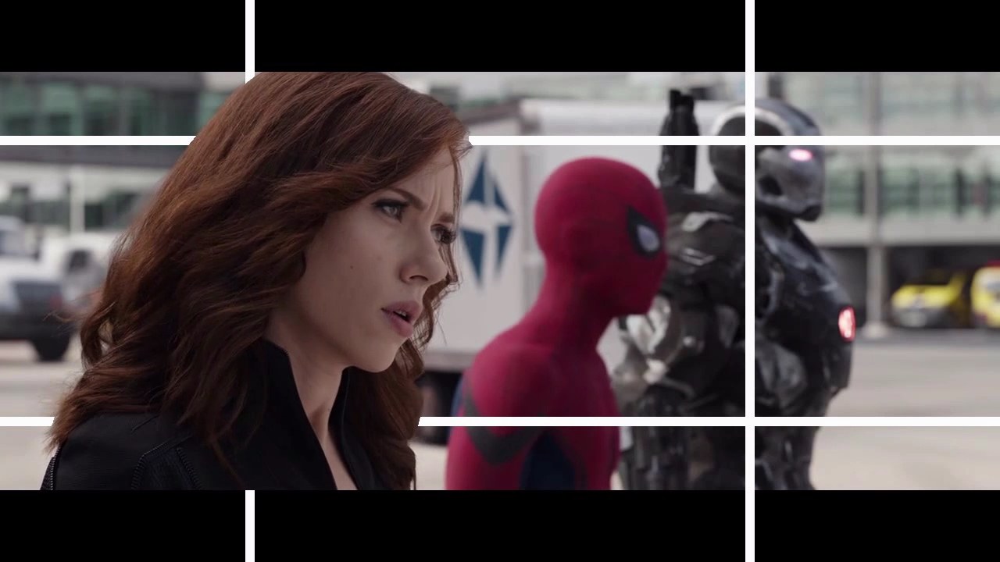

aistudio项目链接: https://aistudio.baidu.com/aistudio/projectdetail/1276777

预览视频: https://www.bilibili.com/video/BV1xK4y177S4

这其实是一种视觉误差而已。即所谓深度知觉。即使用一只眼睛也可以根据各种线索来判断物体的远近。从两张图里不难看出一个特点：两个大范围移动的图像，在运动之前看起来都是在两根白线“后方”...

简单地说，就是两条白线被我们当做了参照物。我们会不自觉地认为，白线离我们更近了，所以白线能挡住后面的图像。而当图像里的物体盖住白线以后，就会立刻给人该物体越过了白线、向我们飞来的错觉。从而有了一种“裸眼3D”的即视感...

以下是一些结果截图:

